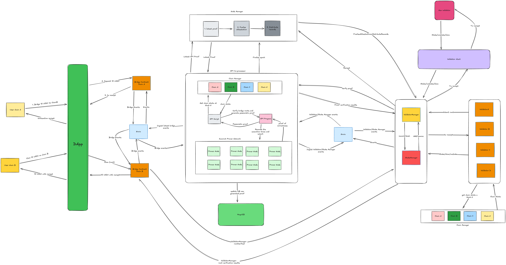

# Bridge Architecture Overview (WIP)

This proof-of-concept cross-chain bridge combines SP1’s **Groth16 zero-knowledge proof** system for periodic settlement with a validator-based pre-confirmation layer. The design supports near-instant asset transfers across EVM-compatible networks while preserving trustless security guarantees. It embraces design trade-offs and known limitations in favor of experimentation and learning.

## Scope and Intent

This system is not production-grade. It is intended as a research prototype to explore the interplay of **pessimistic proofs**, **capital-efficient validator staking**, **fast cross-chain settlement**, and **Groth16 zero-knowledge proofs** in a cross-chain bridge architecture. It knowingly embraces trade-offs and imperfections in pursuit of learning and innovation.

## Architecture

### Hub-Spoke Validator Model

Validators stake on a base chain and are authorized to attest on all satellite networks:

- **Base Chain**: manages global validator registration, staking, and slashing
- **Satellite Networks**: each operates a validator management contract that receives attestations and tracks pre-confirmation
- **Node Manager**: coordinates validator lifecycle and issues short-lived eligibility certificates to attest across networks

### Core Components

- **Validators**: watch for bridge events, verify deposit transactions, request certificates, and submit attestations
- **Node Manager**: enforces staking status, issues certificates, and syncs validator sets across networks
- **Event Indexer**: observes bridge events and distributes them to validators and SP1
- **SP1 Co-Processor**: verifies validator attestations against finalized state and submits Groth16 proofs on-chain
- **Chain Manager**: offers access to finalized headers, transaction receipts, and optional proofs across networks

## Operation Flow

### User Deposits

1. A user deposits tokens into the bridge on the source chain
2. The bridge updates its internal Merkle tree and emits a `Deposit` event containing `depositRoot` and `depositIndex`
3. The event indexer captures and relays the deposit event to validators
4. Validators fetch the receipt, confirm the transaction was in a finalized block, succeeded, and emitted the correct `Deposit` event. They verify that the receipt is committed in the block’s receipts trie
5. On the destination chain, the user submits the `depositRoot` and `depositIndex`. The bridge contract verifies that the root is pre-confirmed by ≥67% of active validators. If valid, the user may claim funds.

### Attestation Process

1. Validators receive deposit events from the indexer
2. Validators request certificates from the node manager
3. The node manager validates staking status and issues certificates
4. Validators verify inclusion, transaction success, and the deposit event via receipts proofs
5. Validators submit BLS-signed attestations plus certificates
6. Once ≥67% of active validators attest to the same root, the root is marked **pre-confirmed**

### Claiming

To claim on a destination chain, the user provides:

- A `depositRoot`
- The `depositIndex`
- A Merkle proof showing their deposit leaf is under that root

The destination bridge verifies the root is pre-confirmed and that the proof is valid before releasing the tokens.

### SP1 Verification and Settlement

On a scheduled interval:

- SP1 collects validator attestations and corresponding finalized deposit receipts
- It verifies that attested roots correspond to actual `Deposit` events in finalized blocks and that processed claims align with those roots
- Optionally, SP1 verifies that the bridge contract’s stored root equals the latest attested root
- SP1 generates a **Groth16 zero-knowledge proof** that these checks were executed correctly and submits it on-chain
- Upon proof verification, rewards are distributed and misbehaving validators are slashed

SP1 does **not** reconstruct the full Merkle tree. It validates consistency between attested roots, transaction receipts, and claims against finalized chain data.

## Validator Obligations

Validators are required to:

- Confirm deposit transactions are included in finalized blocks
- Verify that they succeeded and targeted the correct bridge contract
- Confirm the depositor’s address matches the `from` field
- Verify that the `Deposit` event is included in the transaction receipt and committed via receipts trie
- Sign attestations including `(chainId, blockNumber, bridgeRoot, stateRoot, timestamp)` under a fixed domain

Signing conflicting attestations for the same `(chainId, blockRange)` is equivocation and is subject to slashing within SP1 settlement.

## Quorum, Slashing, and State Storage

- A root is pre-confirmed when at least **67% of active validators (by count)** attest to it
- Equivocation (signing invalid roots) triggers slashing upon proof verification, validators an submit as many different roots per block id so this isnt slashable we only care for when they submit invalid roots.
- The bridge stores only a rolling `currentRoot` and `depositIndex`. Historical roots or full tree data are not persisted

Validators may optionally fetch and verify a storage proof against the block’s `stateRoot` to confirm the stored `currentRoot` matches the attested root, but this is **not required** for pre-confirmation as this will be overkill for this POC.

## Finality, RPC Policy, and Trade-offs

- Validators should query at least two independent RPC endpoints and require consistency in block headers and receipts before attesting. but then since this is POC we trying to reduce complexity by trusting that 1 endpoint will awalys be truthful but this could change lol

### Trade-offs

- **Receipt-based proofs** keep pre-confirmation light and RPC-compatible
- **No per-index root storage** reduces on-chain cost and complexity
- **SP1 as verifier (not reconstructer)** fits a bridge that doesn’t store full historical state
- **Two-thirds quorum by count** balances liveness and simplicity

