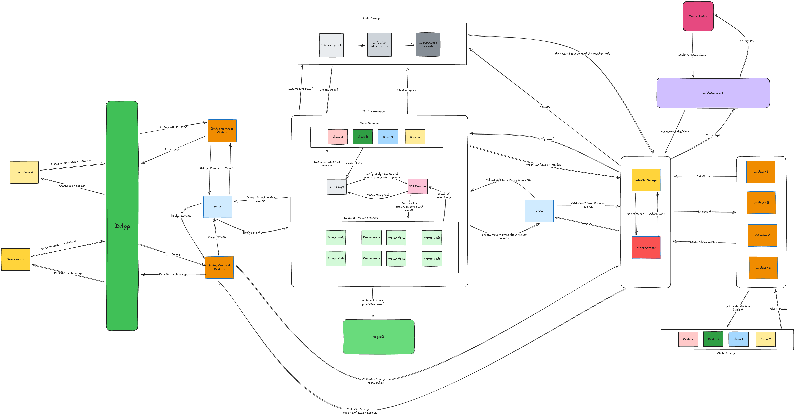

# SP1 Bridge POC

This repository is a research bridge between Ethereum and Base that combines fast validator pre-confirmations with periodic SP1 settlement proofs. The goal is not to ship a production bridge. The goal is to test whether a bridge can feel fast to a user while still ending in a cryptographically accountable state.

## Why this POC exists

Most bridges force an uncomfortable trade-off.

- Fast bridges usually depend on a small trusted operator set.
- Safer bridges usually wait for slow finality and feel worse to use.
- Cross-chain systems also tend to duplicate capital, duplicate trust assumptions, or require heavy chain-specific verification logic.

This POC explores a different shape:

- Users get a fast path from validator pre-confirmations.
- Validators are staked on one base chain instead of every destination chain.
- SP1 later proves that the attested deposits and processed claims line up with finalized chain data.
- Misbehavior can be slashed and honest participation can be rewarded on the base chain.

In the default runtime, Base (`31339`) is the validator base chain. That is where validator stake, rewards, top-ups, slashing, and exits are managed.

## What it attempts to resolve

- The latency versus safety trade-off in bridging.
- The operational cost of maintaining validator stake and policy on every chain independently.
- The gap between a simple user flow and a settlement model that can still be audited after the fact.
- The desire to use normal EVM receipts and finalized chain data instead of building a bespoke light client for every chain in the prototype phase.

## Architecture



### Core components

- `Bridge`: accepts deposits, tracks roots, and processes claims.
- `ValidatorManager`: tracks validator status, certificates, attestations, epochs, and owner-triggered reward distribution.
- `StakeManager`: holds validator stake, pending rewards, reward reserves, and slashing state.
- `Node Manager`: checks validator eligibility, exposes operator endpoints, and performs owner actions such as reserve top-ups and reward distribution.
- `Validators`: watch indexed deposits, verify receipts, and submit attestations.
- `Indexer`: turns bridge events into a queryable feed for validators, the UI, and operations tooling.
- `SP1`: verifies finalized bridge state transitions and submits settlement proofs.
- `Chain Manager`: gives validators and SP1 access to finalized chain data.

### System model

- Validators stake on the base chain and attest across supported chains.
- A deposit can become usable on the destination chain once the destination bridge sees a root pre-confirmed by at least 67% of active validators by count.
- SP1 later checks the finalized facts and closes the loop with proof-backed settlement.

## End-to-end flow

1. A user deposits native ETH or bridge liquidity into the source-chain bridge.
2. The bridge emits a `Deposit` event and updates its current deposit root.
3. The indexer captures the event and validators pick it up.
4. Validators verify the finalized receipt, the bridge target, and the emitted deposit data.
5. Validators request short-lived certificates from node-manager and submit BLS attestations.
6. Once the destination chain sees quorum for a root, the transfer becomes claimable there.
7. SP1 later verifies finalized deposit and claim consistency and submits a settlement proof.
8. After settlement, the owner can distribute validator rewards for the epoch and slash proven bad behavior.

## Running the stack

### Prerequisites

- Docker and Docker Compose
- Rust toolchain with `cargo`
- Foundry with `anvil`, `cast`, and `forge`
- Node.js 20+ with `npm`
- `screen`
- SP1 toolchain via `cargo-prove`

### One-time setup

Run these from the repository root:

```bash
make init
npm install
npm install --prefix contracts
npm install --prefix apps/web
npm install --prefix indexer
```

### Recommended flow: Docker-backed runtime

This is the main path for running the full bridge without switching to the host-managed local stack.

```bash
make start-docker-stack STACK_NAME=docker
```

The generated runtime config will be written to `artifacts/runtime/docker/runtime.generated.json`.

After startup, the main endpoints are:

- UI: `http://127.0.0.1:4273`
- Node manager: `http://127.0.0.1:7011`
- Hasura GraphQL: `http://127.0.0.1:8084/v1/graphql`
- Ethereum fork RPC: `http://127.0.0.1:8545`
- Base fork RPC: `http://127.0.0.1:8546`

Quick health checks:

```bash
curl -fsS http://127.0.0.1:7011/healthz
curl -fsS http://127.0.0.1:4273
```

To stop the Docker-backed runtime:

```bash
make stop-docker-stack STACK_NAME=docker
```

### Optional flow: host-managed local runtime

Use this if you explicitly want the non-Docker runtime agents on the host machine.

```bash
make start-local-stack STACK_NAME=local
```

The host-managed runtime uses:

- UI: `http://127.0.0.1:4173`
- Node manager: `http://127.0.0.1:7001`
- Hasura GraphQL: `http://127.0.0.1:8080/v1/graphql`

## Operating the live bridge

### Upgrade contracts in place

This upgrades the live proxy implementations without redeploying bridge addresses.

```bash
make upgrade-live-contracts UPGRADE_RUNTIME_CONFIG=artifacts/runtime/docker/runtime.generated.json
```

### Trigger live validator scenarios

These commands act against the running bridge, not against mock tests.

```bash
make scenario-slash SCENARIO_VALIDATOR=alice SLASH_AMOUNT_WEI=50000000000000000000
make scenario-jail-recover SCENARIO_VALIDATOR=alice
make scenario-claim-rewards SCENARIO_VALIDATOR=alice
make scenario-distribute-rewards
make live-scenario SCENARIO_ARGS='partial-unstake --validator alice --fast-forward'
```

Scenario commands auto-prefer `artifacts/runtime/docker/runtime.generated.json` when it exists. If you need to be explicit, pass `SCENARIO_STACK_NAME=docker` or `RUNTIME_CONFIG=artifacts/runtime/docker/runtime.generated.json`.

### Top up reward reserves

Reward reserves can be topped up from the Bridge Health tab in the UI or through node-manager. The top-up funds future reward claims. It does not distribute rewards by itself.

```bash
curl -sS \
  -X POST http://127.0.0.1:7011/rewards/top-up \
  -H 'content-type: application/json' \
  -d '{"amountWei":"1000000000000000000"}'
```

To distribute rewards for the current epoch after the reserve is funded:

```bash
make scenario-distribute-rewards
```

## Validator rules in this prototype

- Pre-confirmation requires at least 67% of active validators by count.
- Slashing is now limited to active validators only.
- Replayed finalization batches are rejected.
- If a slash pushes a validator below minimum stake, the validator becomes inactive and can exit instead of being slashed forever.
- Rewards are distributed on the base chain and claimed from base-chain reward reserves.

## Dev artifacts

Generated outputs are ignored at the repository level and in the subprojects that create them. That includes:

- `artifacts/`
- `contracts/cache/`
- `contracts/out/`
- `contracts/bin/`
- `contracts/broadcast/`
- `contracts/deploy-out/`
- `contracts/upgrade-reference/`
- `apps/web/dist/`
- `apps/web/test-results/`
- `indexer/generated/`
- `bls_test_data.json`

Previously tracked deployment artifacts under `contracts/deploy-out/` should stay out of version control after they are removed from the Git index once.

## Trade-offs and limits

- This is a POC and not a production bridge.
- The validator quorum is simple by design and does not model every adversarial condition.
- Receipt-based verification keeps the prototype lighter, but it is not the same thing as a full generalized light client.
- SP1 verifies consistency between finalized bridge facts. It does not rebuild the whole bridge state from scratch.
- Operational safety still depends on correct owner actions for reward reserve funding and epoch reward distribution.

